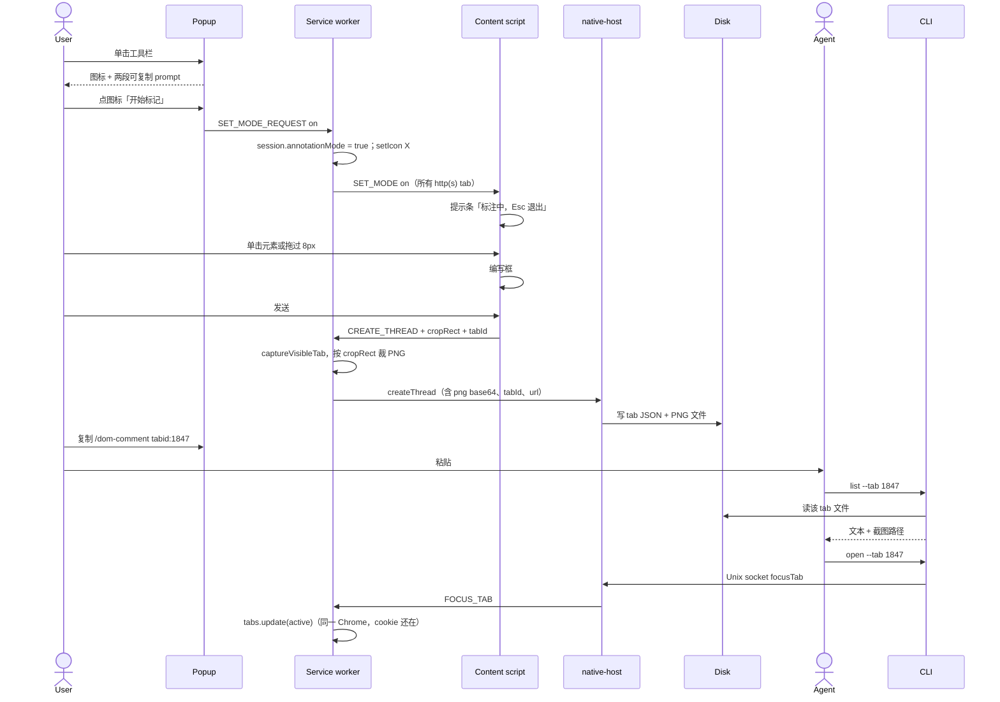

# DOM Comment 设计文档

| 字段 | 值 |
| --- | --- |
| 文档标题 | DOM Comment：Chrome 扩展上的 DOM 元素与区域评论 |
| 作者 | Harvey / AI Workbench |
| 日期 | 2026-08-23 |
| 修订 | rev 7（提交即落盘；复制 `/dom-comment tabid:`；Esc 收起 UI） |
| 状态 | Draft |
| 代码主场 | `/Users/harvey/Code/workbench-dom-comment`（worktree，分支 `feat/dom-comment`） |
| 包路径 | `packages/dom-comment`（`package.json` `name`: `dom-comment`） |
| 兄弟产品 | `packages/markdown-comment`（概念同构，**不**共享包、类型或存储） |

---

## Overview

DOM Comment 让人在 **自己的 Chrome** 里对真实网页做标注：工具栏弹窗开始标记 → 单击元素 / 划选文字 / 拖区域 → 页内编号钉子和悬浮清单。写完即裁切 PNG 并落盘。复制 `/dom-comment tabid:…` 交给 Agent。Esc 退出后页面上的标记 UI 收掉，数据仍在。

Agent **不**和页面直连。默认说「看看我刚才的网页标记」，Skill 跑 `list --open`。复制 `/dom-comment tabid:…` 只是降级。需要复现时：**先看评论瞬间的裁切 PNG**；还要看活页则 `open --tab` **聚焦原 tab**。不上 Playwright / CDP。

存储仍按 **Chrome tab id** 分文件；文件内用 canonical URL 分页面。

**实现门闩：** 先有 OpenSpec change 的 `tasks.md`，再写产品代码。本文是源。

---

## Background & Motivation

`packages/dom-comment/` 已初始化，尚无产品 change 与实现。对标 Codex：标注模式、元素/框选、**评论瞬间截图**、把「当前这次浏览」交给 Agent。

rev 4 按「文档 = URL」存、工具栏直接开关模式、不存图。用户否定了这三点：工作单元是 **正在看的 tab**，不是抽象 URL；入口是 **弹窗 + 可复制 prompt**；复现要 **看见当时的画面**，并处理登录态。

---

## Goals & Non-Goals

### Goals（v1 / rev 7）

- 工具栏弹窗：开始/停止标记、评论数量、复制 `/dom-comment tabid:`。
- 标注中：元素单击、划选文字、直接拖区域；Esc 退出后页面标记 UI 消失；长按空格看原页面。
- 页内悬浮清单：编号列表、删除、复制 `/dom-comment tabid:`。Esc 后 UI 消失。
- 保存瞬间裁切 PNG 并立刻落盘，CLI 马上能读。
- 数据：仍 `{tabId}.json`。
- Skill：先 `tabid:` / `url:`，否则 `list --open`。
- Agent 复现：读截图；必要时 `open --tab`。不上 Playwright / CDP。

### Non-Goals

- 抽取 `comment-core`；与 markdown-comment 合并存储。
- 画笔 / 高亮涂抹 / 全页未裁切截图当唯一载体（要的是 **目标区域裁切**）。
- 协同服务器、多用户、商店上架、Firefox/Safari。
- Windows native host；Edge 登记。自定义 `--user-data-dir` 仍需手写清单。Linux 用户级 Chrome/Chromium（`~/.config/google-chrome` / `~/.config/chromium`）由 `install` 登记。
- `file://` / `chrome://` / 跨域 iframe 内部。
- 扩展内把评论推进某个 Agent 聊天（没有「发给 ChatGPT」按钮）。
- 改名 PageMark、换 `~/.pagemark`、重写 Native Messaging 协议。
- Playwright（含 `launchPersistentContext`、cookie/`storageState` 导出、无头分身）。
- CDP 挂正在跑的 Chrome（`--remote-debugging-port`、`chrome://inspect`、`chrome.debugger`）。
- 无痕窗口 / 空 profile 去重新登录目标站。
- 把评论自动推进某个 Agent 产品的当前聊天（没有「发给 ChatGPT」按钮）。

---

## Key Decisions

| # | 决策 | 理由 |
| --- | --- | --- |
| K1 | Chrome MV3 扩展，Load unpacked；CLI 经 npm 分发 | 扩展仍须手装；host / Skill / 运行时走 `dom-comment` CLI。 |
| K2 | 概念同构、包与存储分离；不抽 markdown-comment core | core 仍绑 VS Code。 |
| K3 | Native Messaging 写盘；另用 **持久 NM 连接 + Unix socket** 给 CLI→扩展（聚焦 tab） | 扩展不能写 `~`；CLI 又要叫 Chrome 聚焦已登录 tab。一次性 `sendNativeMessage` 无法从 CLI 发起。 |
| K4 | 存储主键 = **当前 Chrome 会话 + tabId**；文件内 key = canonical URL | 用户指定。一次浏览里同一 tab 会换 URL，评论应留在这个 tab 下。 |
| K5 | 单击元素、划选文字、直接拖区域；**保存瞬间裁切 PNG** | 拖满 8px 就是框选，不按 Shift。截图给 Agent 看当时画面。 |
| K6 | 工具栏 **popup** 只负责启动；页内悬浮清单负责队列和发布 | action popup 失焦即关，不能当编辑器。 |
| K7 | WXT + React + Tailwind + shadcn | popup / 编写框 / 侧栏。hover 仍是 vanilla overlay。 |
| K8 | hover / 橡皮筋 / 标注中提示条：vanilla overlay | 热路径不打 React、不打 host。 |
| K9 | 编写框进 Shadow `dom-comment-ui`；overlay 用 `dom-comment-overlay` | 防页面 CSS。 |
| K10 | 重定位只在扩展里 best-effort；CLI 不 fetch、不自己判失联 | CLI 没有 DOM。 |
| K11 | 每条线程一张 **裁切 PNG**（元素盒或框选盒）+ 文本 snapshot | Codex 同款「那一瞬间」。不把 PNG 塞进 JSON。 |
| K12 | 侧栏仍做列表；工具栏 **必须有 popup**，故单击工具栏不再切换模式 | 与 K6 一致。 |
| K13 | 生产权限：`nativeMessaging` + `storage` + `offscreen`（若 SW 保活失败）+ http(s) host。PR 4 加 `sidePanel`。不加 `tabs` / 生产 `scripting`。`captureVisibleTab` 靠 host_permissions | 截可见 tab 再裁切，不要 `tabCapture` 流。 |
| K14 | 编号钉只在标注模式显示；复制 `/dom-comment tabid:` | 退出后页面恢复干净。 |
| K15 | Skill 名 `dom-comment`；默认 `list --open`；`tabid:` / `url:` 降级 | 查找先参数，否则最近未解决批次。 |
| K16 | 先 OpenSpec，再产品 PR | 包指南。 |
| K17 | 标注模式仍是扩展全局布尔 | 进入后所有 http(s) tab 可标；Esc 全局退出。 |
| K18 | URL（文件内页面 key）：保留 query、去追踪参数；默认丢 hash，HashRouter `#/` / `#!/` 保留 | 用户已确认。 |
| K19 | tab 文件带 `sessionId`；新 Chrome 会话若 tabId 冲突则把旧文件旋到 `archive/` | tabId 重启后会复用，不能把两次浏览写进同一文件。 |
| K20 | Agent 复现 = **截图 + 聚焦原 tab（A）**。v1 不做 Playwright / CDP / cookie 导出 | 用户拍板。headless 无法占用正在用的 Chrome profile；CDP 是另一套产品。截图是「那一瞬间」；活页只唤回已登录的那个 tab。 |
| K21 | 提交即落盘；复制 `/dom-comment tabid:`（可带 url）；Esc 隐藏页面标记 UI | 人不再当发布闸门。 |

---

## Proposed Design

### 1. 分层

```text
packages/dom-comment/
  wxt.config.ts
  chrome-extension.json
  src/core/          # types, identity, ops, anchor 打分 — 无 chrome / 无 fs / 无 DOM 全局
  src/storage/       # Node fs：tab 文件 + PNG；仅 CLI 与 native-host
  src/cli/
  src/native-host/   # NM stdio + 可选 Unix socket 代理
  src/adapters/extension/
    entrypoints/{background,content,popup,sidepanel}
    highlight.ts     # 描边、橡皮筋、Esc 提示条
    capture.ts
    screenshot.ts    # 视口截图裁切
    relocate-dom.ts
  public/            # icon-plus / icon-x
  resources/skills/dom-comment/
```

扩展禁止 `import` `src/storage` 与 `ops.ts`。铸线程、写 PNG 只发生在 host / CLI。

### 2. 人机闭环（先看这个）

```text
你 ─popup─► 点图标开始标记 ─► 页面蓝框/框选 ─► 写评论
                │                         │
                │ 复制 prompt             │ PNG + JSON
                ▼                         ▼
         Agent 会话 ◄── CLI ── ~/.dom-comment/data/{tabId}.json
                │                           └── {tabId}/{urlHash}/{threadId}.png
                └── open --tab → Unix socket → 扩展聚焦该 tab（已登录）
```

弹窗不把评论推进聊天。**人**把 prompt 粘到 Agent。两边只共享磁盘（以及 Chrome 还在跑时的 socket）。



### 3. 弹窗与标注交互

#### 3.1 工具栏 → popup（不是直接进模式）

`action.default_popup = popup.html`（WXT `entrypoints/popup/index.html`）。**不要**注册 `action.onClicked`。

弹窗（shadcn，中文）两块，**不要**第三块设置页：

1. **图标按钮**
   - 模式关：加号图标，文案「开始标记」。点击 → `SET_MODE_REQUEST on` → `window.close()`。
   - 模式开：X 图标，文案「停止标记」。点击 → 退出模式。
2. **可复制 prompt**（只读文本 + 复制按钮；打开弹窗时读 **当前窗口当前 tab**）

| 说明 | 复制内容（一行 skill 调用，可附说明） |
| --- | --- |
| 查看当前标签页的所有评论 | `/dom-comment tabid:1847` |
| 查看当前页面的所有评论 | `/dom-comment tabid:1847 url:https://example.com/app` |

`url:` 后为 **canonical URL**（K18），与文件内 key 一致。tab 无 http(s) URL（`chrome://`）则第二段禁用，文案「当前页不能标注」。

展示上可以先给人看一行中文，再跟等宽 prompt；复制按钮复制 **整段中文+prompt** 或只复制 `/dom-comment …` 行——**复制内容必须包含 `tabid:` 令牌**，Skill 靠它定位。推荐复制：

```text
查看当前标签页的所有评论
/dom-comment tabid:1847
```

Skill 名写死为 `dom-comment`（包内 Skill），不要写厂商 slash 专有语法以外的前缀；前导 `/` 是用户指定的调用形态。

快捷键 `Alt+Shift+D`：与图标相同，toggle 全局模式（不必先开弹窗）。Esc **只**在页面标注中有效，不关弹窗。

#### 3.2 标注中提示与 Esc

进入模式后，每个 http(s) tab 的 overlay 顶部中间一条 **不挡点击穿透的窄条**（`pointer-events: none`）：

> 标注中 · 按 Esc 退出

Esc（capture，编写框未开）：`preventDefault`，`SET_MODE_REQUEST off`。编写框开着时 Esc **先关编写框**，保持标注模式（与 Codex 取消草稿类似）。再按 Esc 才退出标注。

拖拽中 Esc：取消橡皮筋，保持标注模式。

退出模式：提示条消失，图标回加号，弹窗若再次打开显示「开始标记」。

#### 3.3 hover / 点击 / 框选

与 rev 4 相同，未改：最深合理元素、忽略 `html/body` 与 `DOM-COMMENT-*`、蓝实线描边、`DRAG_THRESHOLD_PX = 8`、虚线橡皮筋、document 坐标存 `AreaRect`。微小拖拽不得抢单击。

#### 3.4 编写框

文案仍是「添加评论」/「写下评论…」/「发送」。贴在元素盒或框选盒旁。成功后关框、**保持标注模式**。v1 只 `CREATE_THREAD`。同一元素再点 = 新线程。

提交前 content 给出 **视口 CSS 像素** 的 `cropRect`（元素 `getBoundingClientRect()` 或框选的视口盒，与视口相交部分；完全在视口外则先 `scrollIntoView({ block: 'center' })` 再取）。

#### 3.5 截图快照（评论瞬间）

在 **用户点发送之后、写盘之前**：

1. SW `chrome.tabs.captureVisibleTab(windowId, { format: 'png' })` → data URL。
2. 扩展内 `createImageBitmap` + canvas，按 `cropRect` 乘 `devicePixelRatio` 裁切。盒与视口相交；最小边 1px；最大边 **1600 CSS px**（超出则等比缩小后再裁，避免超大 PNG）。
3. 得到 PNG bytes，base64 放进 `createThread` 请求（扩展→host 上限 64 MiB，裁切图通常 ≪ 1 MB）。
4. host 写 `{storageDir}/{tabId}/{urlHash}/{threadId}.png`，线程字段 `screenshot` 存相对路径 `{urlHash}/{threadId}.png`。
5. **JSON 里不内嵌 base64。** host→扩展的响应 **不含** PNG（1 MB 上限）。

失败：截图失败仍允许只存文本线程，`screenshot: ''`，编写框可提示「评论已存，截图失败」。不要因此丢掉评论。

Agent 看图：`list --json` 带绝对路径；Skill 指示读取该 PNG。人类 `list` 行尾 `[截图]` 或 `[无截图]`。

#### 3.6 侧栏（PR 4）

默认：**当前 tabId + 当前 URL** 的线程（含缩略不强制，v1 列表用 quote 即可；点击可让 Agent 侧看原图）。开关「此标签页全部页面」。无 resolve/reply。可见时重拉文件。

### 4. Agent 怎么「打开页面」和登录态（已冻结）

v1 **只做 A + 截图**。登录态只存在于用户正在跑的那个 Chrome tab；Agent 不另开浏览器。

| 优先级 | 手段 | 登录态 | 适用 |
| --- | --- | --- | --- |
| 1 | 读线程 PNG + 文本 snapshot | 画面就是登录后的 UI | 默认；tab 没了也够用 |
| 2 | `dom-comment open --tab <id>` 聚焦原 tab | **完整**（就是那个 tab，含内存态） | 还要对照活页时 |

tab 已关或 Chrome 没连上 socket：CLI **失败**（退出码 1），Skill 改看截图。v1 **不**为此再 `tabs.create`、不 `open -a Google Chrome`、不上 Playwright。

**明确不做（以后要另开 change）：**

- Playwright `launchPersistentContext` 挂日常 User Data（Chrome 开着会锁 profile；官方也不支持自动化默认 profile）
- 拷 profile / 导出 `storageState` 再无头分身
- CDP：`--remote-debugging-port`（Chrome 136+ 对默认目录会忽略）、`chrome://inspect` attach、`chrome.debugger`

`open --tab` 实现（仅聚焦，不导航、不新开）：

- 扩展 SW（或 offscreen 页）启动时 `chrome.runtime.connectNative('com.workbench.dom_comment')`，保持端口。仍被杀则用 `offscreen` 托住。
- host 在 NM 存活期间监听 `~/.dom-comment/host.sock`，`chmod 0600`，仅本 uid。
- CLI 连 socket，发 `{ op: 'focusTab', tabId: 1847 }`。host 经 NM 转到扩展。
- 扩展：`chrome.tabs.get` 成功则 `tabs.update({ active: true })` + `windows.update({ focused: true })`。get 失败 → 返回错误，**不** `tabs.create`。
- socket 不存在：退出码 1，中文「Chrome 未连接本地宿主。请先打开 Chrome 并确保扩展已加载。请先查看该评论的截图。」

CLI **绝不** fetch 页面 HTML，也 **不** 依赖 Playwright 包。

### 5. 存储：按 tab 文件，URL 分页面和截图

#### 5.1 布局

```text
~/.dom-comment/
  pointer.json
  host.sock                 # Chrome 连着时才有
  data/
    .session                # 当前 sessionId 一行
    1847.json               # 当前会话、该 tab
    1847/                   # 该 tab 的截图树
      <urlHash>/
        <threadId>.png
    archive/
      <sessionId>-1847.json
      <sessionId>-1847/…
    logs/YYYY-MM-DD.log
```

`urlHash = sha1(canonicalUrl)`（完整 hex）。截图目录按 URL 分开，满足「数据文件内用 url 区分不同页面的截图」——JSON 用 `pages[canonicalUrl]`，PNG 用 `urlHash` 子目录避免路径字符。

没有全局 `docs/<urlHash>.json`。没有用 URL 当主键的 index。`list --tab` 读一个 tab 文件；`findThread` 扫 **当前 session** 下所有 `*.json`（不含 `archive/`）。

#### 5.2 会话与 tabId 复用

Chrome 重启后 tabId 会从小数重新分配。文件头带 `sessionId`。

- **Chrome 进程启动**（`runtime.onStartup`）：才生成新 `sessionId`，写入 `storage.session` / `storage.local` 与 `data/.session`。
- **扩展刷新/更新**：`storage.session` 会被清空，但 tabId 还在。复用磁盘 `.session`，不要 `beginSession`。并把误旋进 `archive/` 的、仍打开着的 tab 评论合并回来。
- 对将要写入的 `{tabId}.json`：若文件存在且 `file.sessionId !== current`，先把 json 和同名目录移到 `archive/{oldSession}-{tabId}`，再写新文件。
- CLI 默认读 `data/.session`；`--tab 1847` 只打开当前 session 的 `1847.json`。不默认翻 archive。

tab 关闭：**不立即删**文件（Agent 可能还拿着 prompt）。下次同 tabId 且新 session 时再 archive。v1 不做 LRU 清理。

#### 5.3 文件形状

```ts
export interface StoredTabFile {
  version: 1;
  tabId: number;
  sessionId: string;
  updatedAt: string; // ISO
  pages: Record<string, StoredPage>; // key = canonicalizeUrl
}

export interface StoredPage {
  url: string;
  title?: string;
  updatedAt: string;
  threads: StoredThread[];
}

export interface StoredThread {
  id: string;
  anchor: StoredAnchor;
  status: 'open' | 'resolved';
  comments: StoredComment[];
  relocateStatus?: RelocateStatus;
  /** 相对 tab 目录，例 `a1b2…/{uuid}.png`；没有则为 '' */
  screenshot: string;
}
```

`StoredAnchor` / `StoredComment` / 元素与区域 kind 同 rev 4（quote、before/after、文本 snapshot）。**另外**每条线程有 `screenshot`。

```ts
function loadTab(dir: string, tabId: number): StoredTabFile {
  // 缺文件或坏 JSON → { version:1, tabId, sessionId: currentSession(), updatedAt: now, pages: {} }
  // 成功则原样返回对象，禁止 mapper 丢字段
}

function saveTab(dir: string, tab: StoredTabFile): void {
  // 若所有 pages 的 threads 都空：删 json + 截图目录
  // 否则原子 rename 写 json；PNG 已由 createThread 先落盘
  // 写之前做 §5.2 session 旋转
}
```

`ops.createThread(tab, url, title, anchor, body, screenshotRel):` 确保 `tab.pages[url]`，push 线程。原地 mutate。`reply` / `resolve` 在 tab 内找 threadId（跨 URL 唯一，UUID）。

`saveTab` 的 `title` 写在 `pages[url].title`：CLI reply **不传 title** 则保留。PNG 文件不因 reply 重写。

PR 1 必测：缺文件 create；reply 不丢 screenshot / relocateStatus / 其它 URL 的页面；session 冲突旋转。

#### 5.4 canonicalizeUrl

仍是 **页面 key**，不是文件名。算法同 rev 4 / K18（去 `utm_*` `gclid` `fbclid` `msclkid` `mc_eid`；非根路径去尾 `/`；HashRouter 保留）。SPA `pushState` 换路径 = 同一 tab 文件里的 **另一个** `pages[]` 条目。

### 6. Native host 协议

一次性 `sendNativeMessage` 仍用于 **创建/读文档**（用户人在 Chrome，SW 醒着）。持久 `connectNative` + Unix socket 用于 **CLI→扩展**。

```ts
type HostRequest =
  | { id: string; op: 'ping' }
  | { id: string; op: 'loadTab'; tabId: number; includeScreenshots?: boolean }
  | {
      id: string;
      op: 'createThread';
      tabId: number;
      url: string;
      title: string;
      captured: CapturedTarget;
      body: string;
      screenshotPngBase64: string; // 无图则 ''
    }
  | { id: string; op: 'reply'; threadId: string; body: string; author: 'user' | 'agent' }
  | { id: string; op: 'resolve'; threadId: string }
  | { id: string; op: 'updateRelocate'; tabId: number; url: string; updates: { threadId: string; state: 'located' | 'orphaned' }[] }
  | { id: string; op: 'focusTab'; tabId: number; url?: string }; // 主要走 socket

type HostResponse =
  | { id: string; ok: true; tab?: StoredTabFile; thread?: StoredThread }
  | { id: string; ok: false; error: string };
```

`loadTab` 给扩展时 **不要**带 PNG 字节；JSON 里只留相对路径。`includeScreenshots` 不把图内嵌进 NM。

`createThread`：空 body 拒绝；`buildAnchor`；`randomUUID` 线程 id；若有 PNG 则先写文件再 `ops.createThread`；`saveTab`。

host 拒绝调用方传来的任意路径。`tabId` 必须是有限正整数。PNG 只写在 `storageDir/{tabId}/{urlHash}/` 下。

`install-host` 算法同 rev 4（profile 根存在才 mkdir NativeMessagingHosts；wrapper 快照 `process.execPath`；PR 2 冻结 `chrome-extension.json`）。额外：host 启动 NM 后 bind socket；NM 断开则 unlink socket。

### 7. DOM 锚点与重定位

捕获、`foldWhitespace`、打分表、阈值 1000、区域 `rectMatched`：**同 rev 4 §7**，不重复展开。文本 snapshot 仍要——截图坏了 Agent 还能读 quote。

**新增：** 适配器在 `buildAnchor` 之外提供 `cropRect`（视口）。不把 cropRect 存进 anchor（重开页面视口不同）；存的是 document `AreaRect` 或元素 css + 那一张 PNG。

### 8. CLI 与 Skill

```text
dom-comment list --tab <id> [--url <canonical>] [--open] [--hidden] [--json] [--name-only]
dom-comment reply <threadId> <text>
dom-comment resolve <threadId>
dom-comment open --tab <id>              # 只聚焦原 tab；失败则看截图
dom-comment install-host / uninstall-host / ping-host
dom-comment install-skill --target <dir>
```

**查找优先级（Skill 与 CLI 一致）：**

1. 显式 `--tab` / 文本里的 `tabid:<digits>`。
2. 若同时有 `--url` / `url:<nonspace>` → 只该 tab 的该页面。
3. 只有 tab → 该 tab 文件里所有 URL，按 `updatedAt` 倒序。
4. 都没有：解析用户口语里的 URL；命中多个 tab 则列出 tabId 让人收窄。**不要**默认 dump 全部 tab。
5. `threadId` 全局扫当前 session（reply/resolve 不需要 tab）。

人类 `list`：

```text
tab 1847
https://example.com/app/settings
  设置
- [元素] button 「保存更改」  #43201ada  [截图]
    - user: 文案太长，折行了
- [区域] 「侧栏导航」  #2173d966  [截图]
    - user: 这整块信息层级乱
```

`--json` 含 `screenshotAbs`、`tabId`、`url`、`quote`、comments。截图路径给 Agent 读图，**不要**把 PNG 打进 JSON stdout。

Skill `resources/skills/dom-comment/SKILL.md`：

- 触发：用户消息含 `/dom-comment`、`tabid:`、或「看看我在页面/标签上的评论」。
- **先解析 `tabid` / `url` 参数，再看其余自然语言。**
- `list --tab …` → 读 `[截图]` 对应 PNG → 按 quote 理解 → `reply` / `resolve`。
- 默认读 `[截图]` PNG。还要看活页：`open --tab` 只聚焦原 tab。tab 没了就停在截图。**禁止** Playwright、CDP、fetch URL 当页面真相。
- `{{CLI}}` 仍是 `node ~/.dom-comment/skill/dom-comment/scripts/dom-comment`。

### 9. MV3 要点

PR 3a manifest：`default_popup`、`nativeMessaging`、`storage`、http(s) host_permissions、`commands`（Alt+Shift+D）。**无** sidePanel。图标 plus 为默认；模式开 `setIcon` 到 X（即使 popup 还画自己的按钮）。

`captureVisibleTab`：需要该 window 的 active tab；提交时用户就在该 tab。popup 已 close。

`externally_connectable` 不设。生产无 `scripting`。

Popup 用 shadcn；content 编写框 Shadow + shadcn；overlay 不用 `all: initial`。

### 10. 与 markdown-comment 的映射

| | markdown-comment | DOM Comment |
| --- | --- | --- |
| 工作单元 | 一个 Markdown 文件 | **一个 Chrome tab**（会话内） |
| 文件内再分 | 无 | canonical URL → 页面 + 截图目录 |
| 锚点 | 行/列 + quote | element css / area rect + quote |
| 那一瞬间 | 原文 quote | quote **+ 裁切 PNG** |
| Agent 入口 | `list [file]` | `/dom-comment tabid:` |

---

## API / Interface Changes

扩展内部：

```ts
type ExtMessage =
  | { type: 'SET_MODE'; on: boolean }
  | { type: 'SET_MODE_REQUEST'; on: boolean }
  | { type: 'CREATE_THREAD'; tabId: number; url: string; title: string; captured: CapturedTarget; cropRect: { x: number; y: number; width: number; height: number }; body: string }
  | { type: 'CREATE_THREAD_RESULT'; ok: boolean; thread?: StoredThread; error?: string }
  | { type: 'LOAD_TAB'; tabId: number }
  | { type: 'LOAD_TAB_RESULT'; ok: boolean; tab?: StoredTabFile; error?: string }
  | { type: 'FOCUS_TAB'; tabId: number; url?: string }
  | { type: 'SET_FOCUS_THREAD'; threadId: string }
  | { type: 'THREADS_CHANGED'; tabId: number; url?: string }
  | { type: 'HOST_ERROR'; message: string };
```

---

## Alternatives Considered

| 方案 | 结论 |
| --- | --- |
| 按 URL 存一文件（rev 4） | 否。用户要 tab 工作单元；同一 URL 开两个 tab 应分开。 |
| tabId 当永久主键、不旋转 session | 否。重启后 id 复用会串数据。 |
| PNG 内嵌 JSON / 经 host→ext | 否。撑爆 1MB、污染 list。 |
| 只存文本、不截图 | 否。用户要对齐 Codex。 |
| Playwright 挂日常 profile / cookie 导出无头分身 | **推迟**。profile 锁 + Chrome 默认目录不能被自动化；v1 用截图 + 聚焦原 tab。 |
| CDP attach（inspect / `chrome.debugger`） | **推迟**。会遥控整只浏览器或弹出调试黄条；v1 不做。 |
| 本地 HTTP daemon | 写盘仍 NM；CLI→扩展用 Unix socket 更窄。不另开 HTTP。 |
| 无 popup、工具栏直接 toggle | 否。用户要复制 prompt。 |
| 页内悬浮清单 | **rev 7 采用**。popup 只启动；持续编辑必须在页面上。 |

---

## Security & Privacy

| 威胁 | 缓解 |
| --- | --- |
| 截图含 PII / 已登录 UI | 文件 `0600`；只本机；Skill 当敏感图；无远程 log |
| socket 被其它用户连 | Unix socket `0600` + 同 uid；不听 TCP |
| 恶意页触发保存 | 无 `externally_connectable` |
| host 写任意路径 | 只允许 `data/{tabId}/` 与 archive |
| 快照 XSS | 禁止 `innerHTML` 渲染 outerHTML |

---

## Observability

host / CLI 日志不记评论 body、不记 PNG。`createThread` 记 tabId、urlHash、threadId、pngBytes。hover < 1 帧；保存（含截图）目标 < 500ms。

---

## Rollout Plan

Load unpacked。验证：弹窗复制的 tabid 能 `list` 到刚标的那条，且 PNG 能打开；`open --tab` 把原 tab 带到前台且仍登录。

回滚 = 禁用扩展。数据留在 `~/.dom-comment`。

---

## Risks

| 风险 | 缓解 |
| --- | --- |
| tabId 复用串会话 | `.session` + archive 旋转 |
| SW 被杀导致 socket 没了 | persist NM；不行则 offscreen；CLI 明确报错并退回截图 |
| `captureVisibleTab` 只拍可见区域 | 先 scrollIntoView；裁相交盒 |
| DPR / 裁切偏移 | 用 `devicePixelRatio`；PR 3b 用固定 fixture 测 |
| Agent 忽略截图去 fetch | Skill 禁止 fetch；list 把图路径放显眼处 |
| prompt 里 url 未 canonical | 弹窗侧先 canonicalize 再展示 |

---

## Open Questions

本轮用户意见已全部拍板，**终局**：

| # | 决定 |
| --- | --- |
| 框选 | v1 做 |
| 入口 | 工具栏 popup；图标开始标记；Esc 停 |
| URL query | 保留，去追踪参数 |
| 截图 | 评论瞬间裁切 PNG |
| 存储 | 按 tabId 文件，内层 URL 分页面和截图 |
| Agent 复现 | **截图 + 聚焦原 tab**。Playwright / CDP 推迟，v1 不做 |

无新的待确认项。

---

## References

- 前版 rev 4 打分表 / `install-host` / WXT alias / `foldWhitespace`（本节未重抄的冻结算法仍有效：见仓库该文件 git 历史或下文「冻结附录」——**打分表与 install-host 以 rev 4 文本为准，rev 5 不改那些数字与 mkdir 规则**）。
- `packages/markdown-comment` 的线程/CLI/Skill 形态。
- Chrome Native Messaging 体积上限；`captureVisibleTab`。

### 冻结附录 A — `foldWhitespace` 与 relocate 打分

```ts
export function foldWhitespace(s: string): string {
  return s.replace(/\s+/g, ' ').trim();
}
export const CONTEXT_LEN = 40;
export const RELOCATE_THRESHOLD = 1_000;
```

Quote 强度：strong = 非空 quote 且 (`text === quote` 或 `startsWith`)；weak = `includes`；否则 none。  
上下文：both / after / before / none（`before.endsWith`、`after.startsWith`）。

加分：strong+both `1_000_000`；strong+after `10_000`；strong+before 或 strong 无上下文 `1_000`；weak+both `10_000`；weak+单侧 `1_000`；weak 无上下文 `0`；`cssMatched` +100；`rectMatched` +100；`xpathMatched` +50；`idMatched` +40；`testIdMatched` +40；tag 相同 +1。

`pickCandidate`：无候选 → null；恰好一名 `cssMatched && strong`（元素）或 `rectMatched && strong`（区域）→ 立即接受；否则最高分，并列取最小下标；`best < 1000` → null。仅 tag/css/rect 而无 quote = 失联。无 `relocateStatus` 要显示。CLI 不自己判失联。

### 冻结附录 B — `install-host`

浏览器 profile 根（存在才写）：Chrome、Chrome Canary、Chromium 的 `~/Library/Application Support/…`。**不做** Edge / Win / Linux。  
wrapper：`exec "<process.execPath>" "<abs native-host.js>"`。  
`chrome-extension.json` 的 key/id 在 PR 2 生成并提交。有 profile 根则 `mkdir` `NativeMessagingHosts` 再写清单。stdout 打印 WRITTEN/SKIPPED。`uninstall-host` 只删该 json。

### 冻结附录 C — WXT / Skill 路径

alias：`path.resolve(pkgRoot, 'src/core')`。PR 3a 无 React、无 sidePanel。侧栏产物 `/sidepanel.html`。扩展只 import identity/anchor/types。  
`{{CLI}}` = `node <homedir>/.dom-comment/skill/dom-comment/scripts/dom-comment`。

---

## PR Plan

Conventional Commits，叠在 `feat/dom-comment`。**PR 0 之前无产品代码、无 Rush。**

### PR 0 — `docs(dom-comment): add OpenSpec change for tab comments`

- 依赖：无
- 影响：`openspec/changes/<kebab>/` proposal、specs、design、tasks
- 内容：从 **rev 6** 压缩；写明 tab 主键、截图、popup prompt、复现=截图+聚焦原 tab（无 Playwright）。`validate --strict`。

### PR 1 — `feat(dom-comment): add tab-keyed storage and CLI`

- 依赖：PR 0
- 影响：`src/core`、`src/storage`、`src/cli`（`list --tab/--url`、`reply`、`resolve`、`open` 可先报「Chrome 未连接」）、Rush 登记
- 内容：`StoredTabFile`、session 旋转、截图路径字段、ops 原地 mutate。无 Chrome。单测含 session 冲突与 reply 不丢 PNG 路径。

### PR 2 — `feat(dom-comment): add native host, install-host, and focus socket`

- 依赖：PR 1
- 影响：`src/native-host`、`install-host` / `ping-host`、`chrome-extension.json`、Unix socket `focusTab`
- 内容：`createThread` 收 tabId + PNG base64。冻结扩展 ID。

### PR 3a — `feat(dom-comment): add popup, annotation mode, and overlay`

- 依赖：PR 2
- 影响：WXT 骨架、`popup`、`highlight.ts`、plus/X 图标
- 内容：popup（图标 + 两段 prompt 复制）、开始标记、Esc、提示条、hover 描边、框选橡皮筋。**不保存、不截图。** 无 side panel。

### PR 3b — `feat(dom-comment): add composer, cropped screenshot, persist`

- 依赖：PR 3a、PR 2
- 影响：Shadow 编写框、`screenshot.ts`、`CREATE_THREAD` + `captureVisibleTab`
- 内容：元素/区域都能存；PNG 裁切；host 缺失中文错误。

### PR 4 — `feat(dom-comment): add side panel for current tab`

- 依赖：PR 3b
- 影响：sidepanel 入口、`LOAD_TAB`
- 内容：默认当前 tab+URL；可看该 tab 其它 URL。只读。

### PR 5 — `feat(dom-comment): add Skill that parses tabid/url`

- 依赖：PR 1（CLI）。可与 3a–4 并行
- 影响：Skill、`install-skill`、`SCAN_PREFIXES`
- 内容：参数优先；读截图；禁止空 profile 打开。

### PR 6 — `feat(dom-comment): markers, resolve in UI, docs`

- 依赖：PR 4
- 内容：钉 / 区域框回放、侧栏 resolve、README。`open --tab` 若 3b 已通则本 PR 只补文档。

顺序：0 → 1 → 2 → 3a → 3b → 4 → 6；5 在 1 之后、6 之前。
