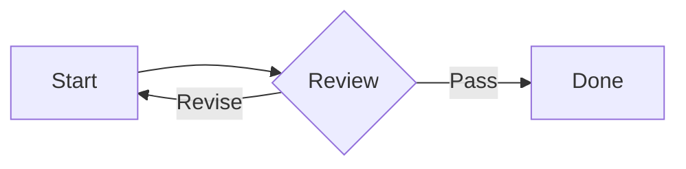

# Preview Fixture

这是一段用于测试普通划词评论和[当前标题跳转](#local-assets)的文本。

Inline math: $E = mc^2$.

$$
\int_0^1 x^2 \, dx = \frac{1}{3}
$$

## Code

```ts
interface PreviewState {
  line: number;
  diagramScale: number;
}
```

```unknown-language
plain <text> must stay escaped
```

## Mermaid



```mermaid
flowchart LR
  This is invalid
```

<details>
<summary>可展开内容</summary>

修改文档后应保持展开状态。

</details>

## Local Assets


[返回顶部](#preview-fixture)

